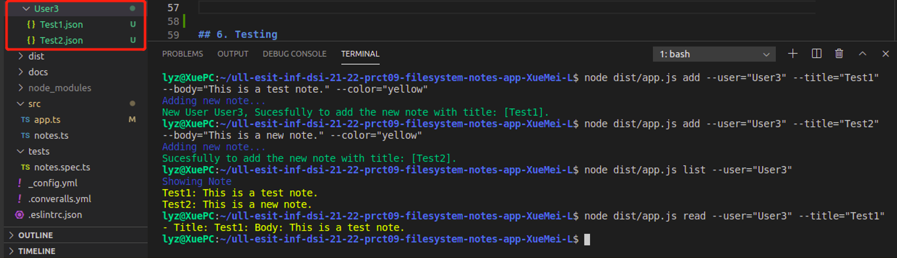
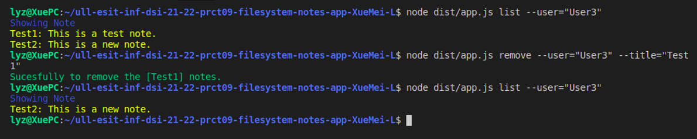
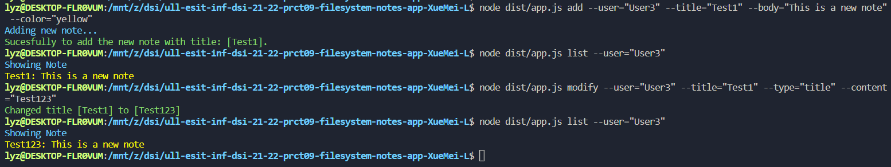
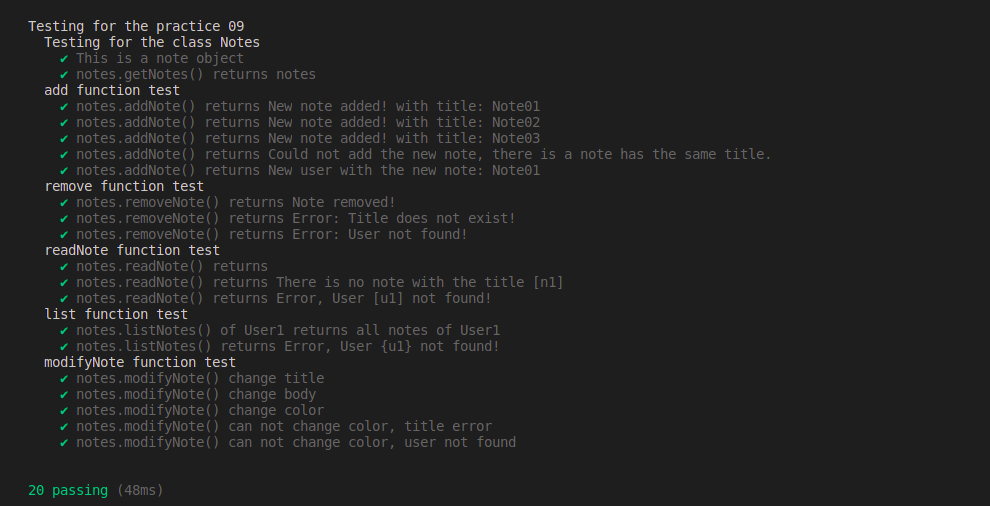

# 07 - Digitalizando la colección de música de los abuelos
```
Autora: Xue Mei Lin
Curso: 2021- 2022
Universidad: Universidad de La laguna
Asignatura: Desarrollo de Sistemas Informaticos
Herramienta: Visual Studio Code
Lenguaje de programción: TypeScipt
```
## 1. Introduccion
En esta practica, vamos a aprender como usar la aplicación de procesamiento de notas de texto, y basado en los conocimientos que hemos aprendido en la clase, vamos a programar una pequeña aplicación sobre añadir, modificar, eliminar, listar y leer notas de un usuario concreto.

## 2. Objetivo
- Aprender API de Node.js
- Aprender a utilizar yargs
- Aprender a utilizarr chalk

## 3. Desarrollo

## 3.1. class Notes
En la clase note es la implementacion de las funciones que añade, modifica, elimina las notas.

Descripción general sobre los requisitos de la aplicación de procesamiento de notas de texto.
Los requisitos que debe cumplir la aplicación de procesamiento de notas de texto son los siguientes:
 1- La aplicación de notas tiene que ser multíples usuarios
 2- Una nota tiene que tener por lo menos un titulo, una cuerpo o una color.
 3- Cada usuario tiene su propio lista de notas que son

Los siguientes son los casos necesarios que hay que implementar en la práctica.

**Caso 1** - Añadir una nota, en este caso, tenemos que comprobar que si ya existe o no, es decir si tiene el mismo titulo que una nota almacenado. Si ya existe, saldrá errores.
```
node dist/app.js add --user="User3" --title="TestNote_01" --body="This is a test note." --color="blue"
```

**Caso 2** - Para modificar una nota de la lista, hay que comprobarlo si existe una una lista de la nota que vas a modificar, si existe podemos modificar la nota , el caso contrario, saldrá errores también.
```
node dist/app.js modify --user="User3" --title="TestNote_01" --type="color" --color="green"
```

**Caso 3** - Realizar la eliminación de una nota, tenemos que comprobar si existe el nota o no , si existe puedes eliminar ,el contrario si no existe no se puede eliminar y indicando error.**
```
node dist/app.js delete --user="User1" --title="TestNote_01"
```

**Caso 4** - Para listar los nombres de la nota de la lista tenemos que utilizar el paquete chalk y como el resultado saldr con el color corresponde de cada unos de ellos.
```
node dist/app.js list --user="User1"
```

**Caso 5** - Si queremos leer una nota concreta, tenemos que comprobar si existe está lista con estas nota o no, si existe va salir con el color corresponde de paquete chalk, el contrario dará errores.
```
node dist/app.js read --user="User1" --title="Note01"
```

## 3.2. El programa principal
El programa principal usa el paquete `yargs` para la interacción con usuarios. Por ejemplo en el caso de **añadir una nota**, necesita que el usuario ejecuta el programa con 4 parametros **--user**, **--title**, **--body**, **--color**. Comprobar que los 4 parametros son de tipo `string`, y realiza la llamada de la funcion `add()`, los demas comandos son muy similares.


## 4. Conclusion
Como conclusion, hemos aprendido cosas nuevas como por ejemplo yargs y chalk. Asimismo hemos forzado el conocimiento sobre typescrit, API, etc. Ha sido una practica interesante. Me gustaria aprender más sobre dicho conocimiento.

## 5. Resultados





## 6. Testing



## 5. Bibliografía
- [Apuntes de la clases](https://ull-esit-inf-dsi-2122.github.io/typescript-theory/)
- [Guión de la práctica](https://ull-esit-inf-dsi-2122.github.io/prct07-music-dataModel/)
- [Inquirer.js](https://www.npmjs.com/package/inquirer)
- [Lowdb](https://www.npmjs.com/package/lowdb)
- [Coveralls](https://coveralls.io/)
- [SounarCould](https://sonarcloud.io/)
- [Yargs](https://www.npmjs.com/package/yargs)
- [Chalk](https://www.npmjs.com/package/chalk)

